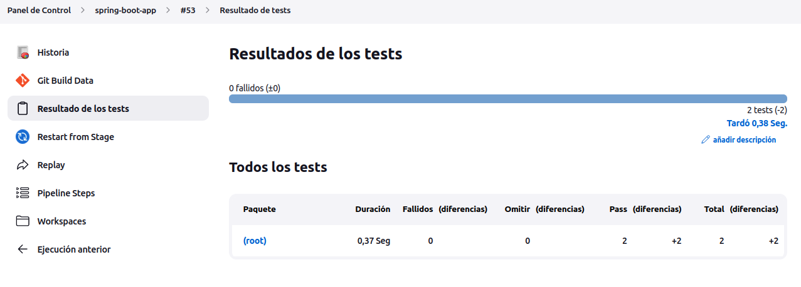
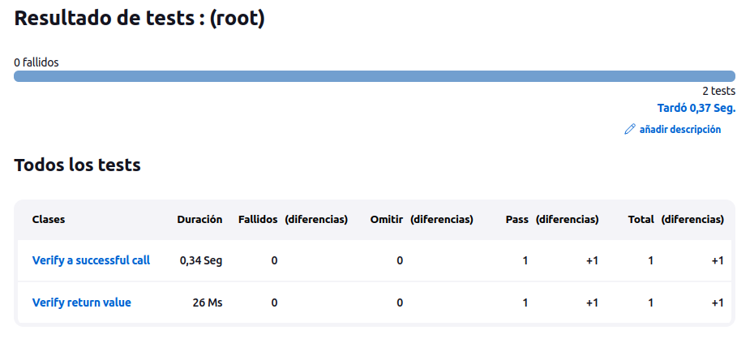

# Trabajo Práctico 10 - Pruebas de Integracion

## Conceptos generales

### Pruebas de integración
Una prueba de integración tiene como objetivo probar el comportamiento de un componente o la integración entre un conjunto de componentes. El término prueba funcional se usa a veces como sinónimo para prueba de integración. Las pruebas de integración comprueban que todo el sistema funciona según lo previsto, por lo que reducen la necesidad de pruebas manuales intensivas.

Este tipo de pruebas le permiten traducir sus historias de usuario en un conjunto de pruebas. La prueba se asemejaría a una interacción esperada del usuario con la aplicación.

### Frameworks de pruebas 

Existen una gran variedad de herramientas o frameworks disponibles para las pruebas de integración, tanto para componentes del backend como del frontend. Estas pueden ser comerciales, de código abierto o desarrolladas y utilizadas internamente por las compañías de software.

Para este trabajo práctico vamos a probar aplicaciones web y rest y para ello utilizaremos Codeceptjs como ejemplo.

### Selenium

Selenium es una herramienta de prueba de software automatizada y de código abierto para probar aplicaciones web. Tiene capacidades para operar en diferentes navegadores y sistemas operativos. Selenium es un conjunto de herramientas que ayuda a los testers a automatizar las aplicaciones basadas en la web de manera más eficiente.

Podemos codificar las pruebas directamente en un lenguaje de programación, por ejemplo javascript y ejecutarlas como parte del proceso de CI/CD.

### Codeceptjs https://codecept.io/

Codeceptjs es un framework end to end para pruebas de integración y de aceptación de usuario, es muy simple de usar y abstrae al que escribe los tests de trabajar directamente con el driver de Selenium o algún otro driver.

## Familiarizarse con CodeceptJs
- El objeto **I** y sus funcionalidades básicas: https://codecept.io/basics
> El objeto **I** es un actor, una abstracción para un usuario de prueba. El **I** es un objeto proxy para los driver actualmente habilitados. 
~~~ js 
I.amOnPage('/'); // -> opens http://site.com/
I.click('Login', '.nav'); // search only in .nav
I.click('Login', {css: 'footer'}); // search only in footer
I.see('Please Login', 'h1');
I.fillField('Name', 'Miles');
I.selectOption('Role','Admin');
I.seeElement('.user'); // element with CSS class user
I.seeElement('//button[contains(., "press me")]'); // button
// ...
~~~

## Testeando la página de GitHub
- En un directorio, por ejemplo **.\proyectos\ut** ejecutar:

```bash
npx create-codeceptjs .
```

- Si esta utilizando codeceptjs 3.0.0, hay que actualizar a uno superior, por ejemplo 3.0.1
- Cambiar en packages.json `"codeceptjs": "^3.0.0",` por `"codeceptjs": "^3.0.1",` y ejecutar `npm install`
- Ininicializar un nuevo proyecto CodeceptJS:
```bash
npx codeceptjs init
```
- Elegimos las opciones por defecto, ponemos **github** cuando se nos pregunte por el nombre del primer test:
```bash
/home/juandu/Escritorio/INGSOFT3/ingsoft3/tp10/proyectos/ut/>npx codeceptjs init

  Welcome to CodeceptJS initialization tool
  It will prepare and configure a test environment for you

Installing to /home/juandu/Escritorio/INGSOFT3/ingsoft3/tp10/proyectos/ut/
? Where are your tests located? ./*_test.js
? What helpers do you want to use? (Use arrow keys)
> Playwright
  WebDriver
  Puppeteer
  TestCafe
  Protractor
  Nightmare
  Appium
? Where should logs, screenshots, and reports to be stored? ./output
? Do you want localization for tests? (See https://codecept.io/translation/) English (no localization)
Configure helpers...
? [Playwright] Base url of site to be tested http://localhost
? [Playwright] Show browser window Yes
? [Playwright] Browser in which testing will be performed. Possible options: chromium, firefox or webkit chromium

Steps file created at ./steps_file.js
Config created at /home/juandu/Escritorio/INGSOFT3/ingsoft3/tp10/proyectos/ut/codecept.conf.js
Directory for temporary output files created at './output'
Intellisense enabled in /home/juandu/Escritorio/INGSOFT3/ingsoft3/tp10/proyectos/ut/jsconfig.json
TypeScript Definitions provide autocompletion in Visual Studio Code and other IDEs
Definitions were generated in steps.d.ts

 Almost ready... Next step:
Creating a new test...
----------------------
? Feature which is being tested (ex: account, login, etc) github
? Filename of a test github_test.js

Test for github_test.js was created in /home/juandu/Escritorio/INGSOFT3/ingsoft3/tp10/proyectos/ut/github_test.js

--
CodeceptJS Installed! Enjoy supercharged testing! �
Find more information at https://codecept.io
```
- Escribir un escenario de prueba:
```
Feature('github');

Scenario('test something', ( {I} ) => {
  I.amOnPage('https://github.com');
  I.see('GitHub');
});
```
- Finalmente correr el test:
```npx codeceptjs run --steps```


- Agregamos otras validaciones
```javascript
Scenario('test something', ({ I }) => {
    I.amOnPage('https://github.com');
    I.see('GitHub');
    I.see('The home for all developers')
    I.scrollPageToBottom()
    I.seeElement("//li[contains(.,'© 2022 GitHub, Inc.')]")
});
```
```bash
(base) juandu@juan:~/Escritorio/INGSOFT3/ingsoft3/tp10/proyectos/ut$ npx codeceptjs run --steps
context
CodeceptJS v3.3.6 #StandWithUkraine
Using test root "/home/juandu/Escritorio/INGSOFT3/ingsoft3/tp10/proyectos/ut"

github --
  test something
    I am on page "https://github.com"
    I see "GitHub"
    I see "The home for all developers"
    I scroll page to bottom 
    I see element "//li[contains(.,'© 2022 GitHub, Inc.')]"
  ✔ OK in 4098ms

  OK  | 1 passed   // 7s
```
- Para generar selectores fácilmente utilizamos plugins como (Firefox o Chrome)
  - TruePath https://addons.mozilla.org/en-US/firefox/addon/truepath/
  - ChroPath https://chrome.google.com/webstore/detail/chropath/ljngjbnaijcbncmcnjfhigebomdlkcjo

## 3- Testeando la aplicación spring-boot
- En un directorio, por ejemplo **.\proyectos\spring-boot-it** ejecutar:
```bash
npx create-codeceptjs .
```
- Instalar CodeceptJS con la librería webdriverio
```npm install codeceptjs chai --save-dev```
- Inicializar CodeceptJS: ```npx codeceptjs init```
- Responder las preguntas. Aceptar valores por defecto. Cuando pregunte por url colocar `http://localhost:8080` y y el nombre de los tests poner `spring-boot`
- Editar el archivo generado `spring-boot_test.js`:
```javascript
Feature('spring-boot');

const expect = require('chai').expect;
const {I} = inject();

Scenario('Verify a successful call', async () => {
	const res = await I.sendGetRequest('/');
	expect(res.status).to.eql(200);
});

Scenario('Verify return value', async () => {
	const res = await I.sendGetRequest('/');
	//console.log(res);
	expect(res.data.message).to.eql('Spring boot says hello from a Docker container');
});
```
- Reemplazar la sección helpers de codecept.conf.js por:
```javascript
	helpers: {
		REST: {
			endpoint: "http://localhost:8080",
			onRequest: () => {
			}
		}
	}
```
- Levantar la aplicación spring-boot en otra consola (usando java o Docker):
```bash
cd ./proyectos/spring-boot
java -jar target/spring-boot-sample-actuator-2.0.2.jar
```
- Ejecutar los tests desde la carpeta `.\proyectos\spring-boot-it`
```
npx codeceptjs run --steps
```
- Analizar resultados
```js
$ npx codeceptjs run --steps
CodeceptJS v3.3.6 #StandWithUkraine
Using test root "/home/juandu/Escritorio/INGSOFT3/ingsoft3/tp10/proyectos/spring-boot-it"

spring-boot --
  Verify a successful call
    I send get request "/"
  ✔ OK in 65ms

  Verify return value
    I send get request "/"
  ✔ OK in 21ms

  OK  | 2 passed   // 105ms
```
- Codeceptjs realiza dos tests, el primero realiza un get request al / y espera un 200 y el segundo realiza el get request y verifica que el mensaje esperado sea "Spring boot says hello from a Docker container"

## Habilitar reportes para utilizarlos en CICD
- Instalar el módulo para reporting
```bash
npm i mocha-junit-reporter mocha-multi --save
```
- Reemplazar la key mocha en el archivo codecept.conf.js por:

```javascript
	mocha:  {
    "reporterOptions": {
      "codeceptjs-cli-reporter": {
        "stdout": "-",
        "options": {
          "steps": true,
        }
      },
      "mocha-junit-reporter": {
        "stdout": "./output/console.log",
        "options": {
          "mochaFile": "./output/result.xml"
        },
        "attachments": true //add screenshot for a failed test
		  }
		}
	}
```
- Ejecutar los tests nuevamente
```bash
npx codeceptjs run --steps --reporter mocha-multi
```
- La salida compatible con Jenkins esta en ./output/results.xml
```xml
<?xml version="1.0" encoding="UTF-8"?>
<testsuites name="Mocha Tests" time="0.389" tests="2" failures="0">
  <testsuite name="Root Suite" timestamp="2022-10-20T19:11:04" tests="0" time="0.000" failures="0">
  </testsuite>
  <testsuite name="spring-boot" timestamp="2022-10-20T19:11:04" tests="2" file="/home/juandu/Escritorio/INGSOFT3/ingsoft3/tp10/proyectos/spring-boot-it/spring-boot_test.js" time="0.382" failures="0">
    <testcase name="spring-boot: Verify a successful call" time="0.344" classname="Verify a successful call">
    </testcase>
    <testcase name="spring-boot: Verify return value" time="0.026" classname="Verify return value">
    </testcase>
  </testsuite>
</testsuites>
```
## Integrar la ejecución en Jenkins
- Utilizando la funcionalidad de Junit test en Jenkins colectar estos resultados de la ejecución después del deployment.
- Agregamos el siguente stage en el pipeline:
~~~
stage('Integracion Tests'){
  steps{
    dir('tp10/proyectos/spring-boot-it/output'){
      junit 'result.xml'
    }
  }
}
~~~

