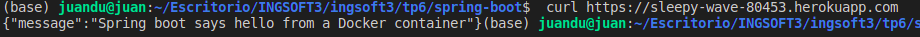

# Trabajo Práctico 12 - Despliegue de Aplicaciones
## 1- Configurando Heroku
- Crear una cuenta en Heroku https://dashboard.heroku.com
- Instalar la utilidad de línea de comando de Heroku: https://devcenter.heroku.com/articles/heroku-cli
- Abrir una línea de comandos y registrase con la aplicación CLI
```
heroku login
heroku container:login
```


## 2- Creando y Desplegando la aplicación Payroll
- Modificar el archivo Dockerfile de nuestra aplicación para que sea compatible con Heroku (necesitamos definir una variable de entorno para el puerto donde correrá el servicio):
```
FROM java:8-jre-alpine
RUN apk add --no-cache bash
WORKDIR /app
COPY target/*.jar ./spring-boot-application.jar
ENV PORT=8080
EXPOSE 8080
CMD ["java", "-Xms32m", "-Xmx128m", "-jar", "-Dserver.port=${PORT}", "-Djava.security.egd=file:/dev/. urandom", "spring-boot-application.jar"]
```

- Abrir una línea de comandos y cambiar el directorio a donde se encuentra nuestra aplicación
```
cd ../tp6/spring-boot
```
- Crear una nueva aplicación en Heroku
```
heroku create
```
- Esto creara un aplicación con un nombre determinando, en este caso **sleepy-wave-80453**
- Generar y subir la imagen de Docker al registry de Heroku, desde este registry se desplegará la aplicación en Heroku
```
heroku container:push web --app=sleepy-wave-80453
```
- Una vez terminada la operación, procedemos a desplegar la aplicación
```
heroku container:release web --app=sleepy-wave-80453
```
- Nuestra aplicación estará ahora disponible en https://sleepy-wave-80453.herokuapp.com/
```
$ curl https://sleepy-wave-80453.herokuapp.com
{"message":"Spring boot says hello from a Docker container"}
$
```
- Con esto vemos que está retornando el mensaje esperado.

