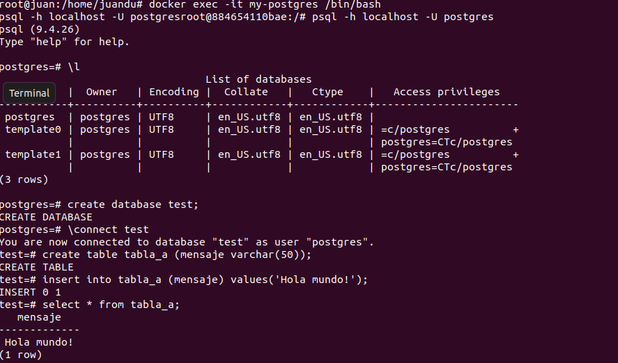

# Docker
## Instalacion
- Para la instalación utilizo el comando: 
    
    sudo apt  install docker.io
    
- Probamos el funcionamiento corriendo un comando de prueba:
    

## Obtener imagenes 
- Obtener la imagen BusyBox con el siguiente comando:
  
    docker pull busybox

- Verificar qué versión y tamaño tiene la imagen bajada, obtener una lista de
imágenes locales con el siguiente comando:

    docker images
    
    

## Ejecutando contenedores
- Ejecutar un contenedor ingresando el siguiente comando:
  
    docker run busybox

    Al correr el comandpo, no se obtiene ningun resultado ya que no se esta ingresando ninguna instruccion mas.

- Ver contenedores ejecutados con el siguente comando:

    docker ps -a

    
    Se obtiene el listado de ejecuciones de contenedores, mostrando el comando utilizado al correrlo.

## Ejecutando en modo interactivo
- Ejecutar un contenedor ingresando el siguiente comando:
    
    docker run -it busybox sh

- Ingresar comandos en la shell:
    

## Borrando contenedores
- Para borrar un contenedor especifico ingresar el siguiente comando:
    
    docker rm nombre_o_id_del_contenedor

    

- Para eliminar todos los contenedores que no estan corriendo, ingresar el siguiente comando:
  
    docker rm $(docker ps -a -q -f status=exited)   
   
    ó
    
    docker container prune

     

## Montando Volumenes
- Conectar un contenedor a un entorno exterior, con el siguiente comando:
  
    docker run -it -v C:\Users\misuario\Desktop:/var/escritorio busybox /bin/sh
    

## Publicando Puertos
- Ejecutar una imagen con el siguiente comando:
    
    docker run -d daviey/nyan-cat-web
    

- El comando de arriba genera error porque no se levantó el puerto al ejecutar el contenedor, para ello ingresar el comando de la siguiente manera:

    docker run -d -p 80:80 daviey/nyan-cat-web
    

## Utilizando una Base de Datos
- Levantar una base de datos PostgreSQL:

    mkdir $HOME/.postgres
    
    docker run --name my-postgres -e POSTGRES_PASSWORD=mysecretpassword -v $HOME/.postgres:/var/lib/postgresql/data -p 5432:5432 -d postgres:9.4

    

### Docker run y Docker exec
- En el comando **run** ingresamos un nombre al contenedor, seteamos variables de entorno (la contraseña)y creamos el volumen en un path determinado. Luego ingresamos el nombre de la imagen y exponemos el puerto.
- En el comando **exec** permite ingresar un comando en un contenedor corriendo, lo hacemos interactivo.