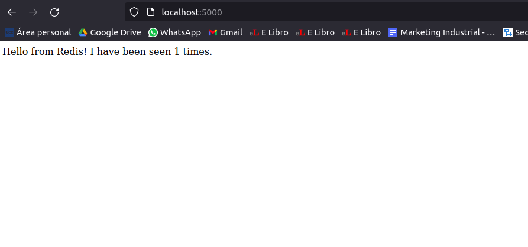
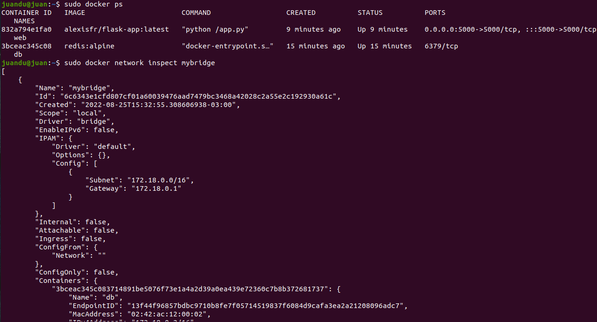
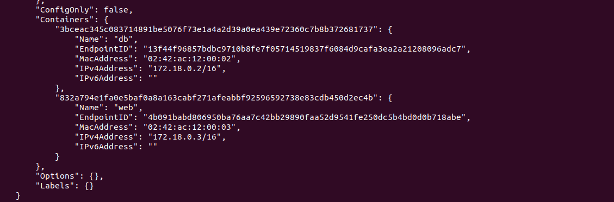
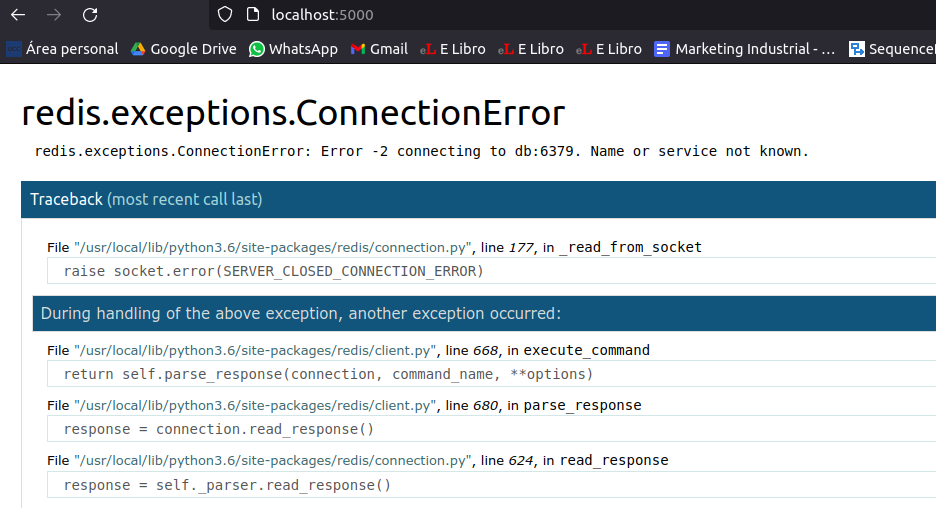
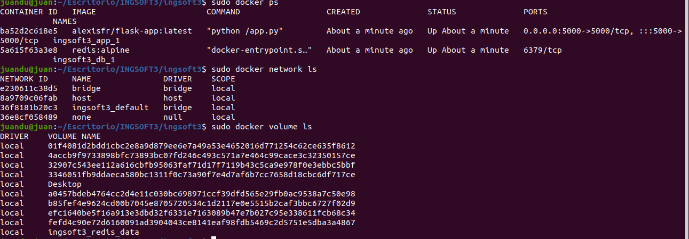
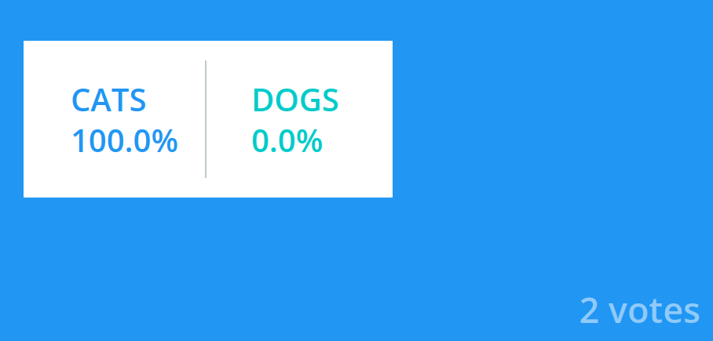
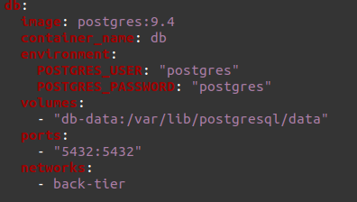
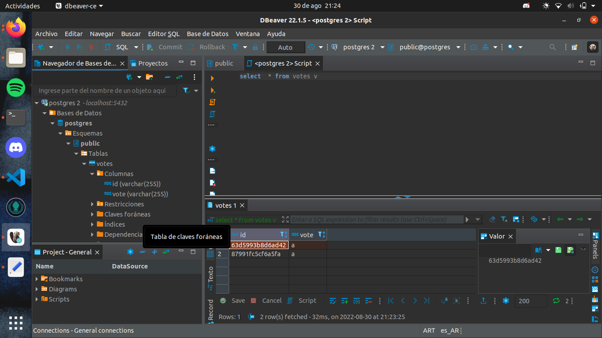
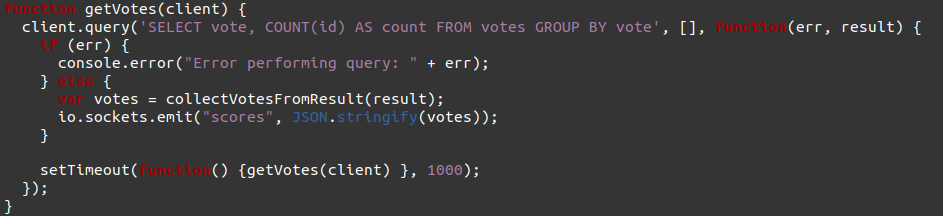
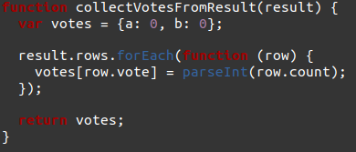

# Ejercicios de Arquitectura de Sistemas Distribuidos
## Sistema distribuido simple
- Crear una red Docker:  
> docker network create -d bridge mybridge
- Instanciar una base de datos Redis conectada a esa Red:
> docker run -d --net mybridge --name db redis:alpine
- Levantar una aplicacion web, que utilice esta base de datos
> docker run -d --net mybridge -e REDIS_HOST=db -e REDIS_PORT=6379 -p 5000:5000 --name web alexisfr flask-app:latest

- Chequeo de los contenedores y la red Docker: 
  
 

## Analisis del sistema
- El sistema utiliza flask y redis como db. Contiene una funcion "hello" que incrementa el valor de  *hits* en uno, utilizando la funcion de redis incr y luego muestra el valor de *hits* en un print
- ¿Para qué se sirven y porque están los parámetros -e en el segundo Docker run del ejercicio 1?
> Para agregar variables de entorno y puedan funcionar en un puerto especifico.
- Si borro el contenedor web, y vuelvo a levantarlo. La web mantiene persistente los datos anteriores.
- Si borro el contenedor db, la web devuelve un error ya que no reconoce un servicio llamado db de redis.

- Si vuelvo a levantar el contenedor, la web funciona pero los datos anteriores de la base, son borrados.
- Para mantener la persistencia, habria que crear un volumes.

## Docker Compose
- Correr el docker compose creado 
> docker-compose up -d
- Que hizo el docker compose?

Levantó dos contenedores con redis y la app respectivamente. En la app genera el vinculo con el servicio db y crea el entorno para que levante la app en el puerto 5000. Y por ultimo crea el volumes en la db para que se persista la informacion.

## Sistema Distribuido Complejo
- Correr docker compose:

- Explicacion de como está configurado el sistema:

~~~ 
 Contiene una app pyhton que corre en el puerto 5000 que permite realizar un voto.
 Y una app javascript para mostar los resultados de la votacion, corriendo en el puerto 5001.
 Ambas poseen un volumes propio, para persistir la informacion.
 El docker-compose crea dos redes para vincular los contenedores, una para el front del tier y otra para el back.
 Y utiliza un postgres para la base de datos redis
~~~

## Analisis detallado
- Exponiendo el puerto de postgres para utilizar la base de datos en el IDE Dbeaver

- El programa **app.py** envia los votos a redis, haciendo un push a la base cuando el cliente hace un post. Crea un json con el id del voter y el valor del voto y lo envia como parametro cuando hace el push a redis
- El programa **worker** es el que crea la base con la tabla y las columnas y realiza la operacion de insert o de update, la informacion la obtiene leyendo el valor guardado en redis.
- El programa **server.js** muestra los valores de la votacion, utilizando el framework express. Este programa realiza el conteo de los votos en una funcion que utiliza la siguiente secuencia sql para obtener los valores de la base postgres: 

