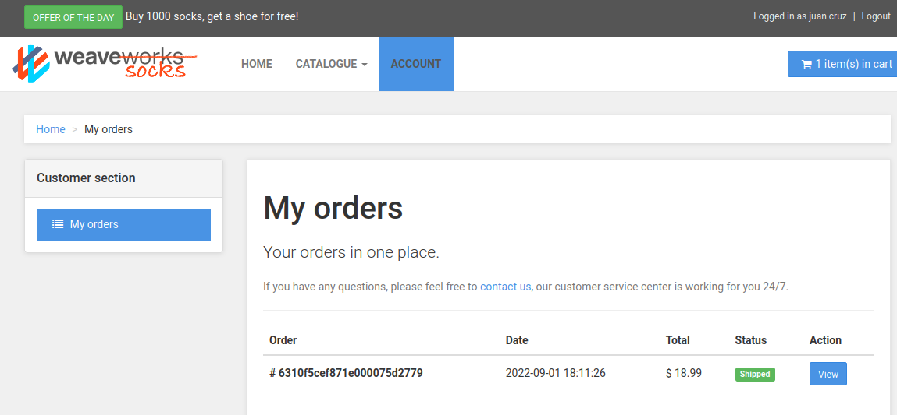
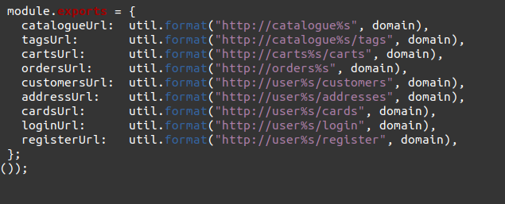

# Microservicios
## Instalacion
- Correr el docker-compose e ingresar a http://localhost
- *Vista de "mis compras":*

## Investigacion de los componentes
- El sistema esta compuesto por los siguientes componentes:
  * *front-end* encargado de levantar la interfaz de usuario
  * *edge-router* que corre en el puerto 80 y es el que maneja las rutas
  * *catalogue* que brinda el catalogo de los productos
  * *catalogue-db* es la base de datos que guarda los productos
  * *carts* es el servicio para la logica del carrito de compra
  * *carts-db* es la base de datos mongo que guarda la informacion del carrito de compras
  * *orders* es el servicio para la logica de las ordenes de compra
  * *orders-db* es la base de datos mongo que guarda la informacion de las ordenes de compra
  * *shipping* es el servicio para la logica del proceso de compra
  * *queue-master* brinda el volumes y procesa la cola del rabbitmq
  * *rabbitmq* es un software de negociación de mensajes de código abierto que funciona como un middleware de mensajería, funciona como cola donde van los mensajes
  * *payment* es el servicio para la logica de pago
  * *user* es el servicio para la logica de los usuarios
  * *user-db* es la base de datos que guarda la informacion de los usuarios
  * *user-sim* es el servicio con la logica para testear/simular un usuario
  
    De estos, el **punto de ingreso al sistema** es el contenedor edge-router que abre el puerto 80.

## Repositorios separados
Se utilizan repositorios separados para el código y la configuracion del sistema ya que cumplen funcionalidades diferentes, las cuales pueden tratarse de manera aislada, la siguiente tabla resume beneficios y desventajas:
  
| Ventajas | Desventajas |
|--------- | ----------- |
| Tolerancia a fallos | Puede fallar la comunicacion |
| Escalabilidad | Genera dependencia entre los componentes |
| Coordinación | Mas procesos pueden fallar |
| Comunicación | Comportamiento emergentes |
| Manejo de errores |  |

## Endpoints para cada servicio

- El contenedor **edge-router** es el que hace las veces de API Gateway
- Cuando se ejecuta el comando: *curl http://localhost/customers*, el servicio que procesa la operacion es **user**
- Cuando se ejecuta el comando: *curl http://localhost/catalogue*, 
el servicio que procesa la operacion es **catalogue**
- Cuando se ejecuta el comando: *curl http://localhost/tags*, el servicio que procesa la operacion es **catalogue**

## Persistencia

- Los datos se persisten con las bases de datos, los servicios que tienen base de datos son: el **catalog**(MYSQL), **cart**(MONGO), **orders**(MONGO),**user**(MONGO)

## Colas
- El componente encargado del procesamiento de las colas es el **queue-master**

## Interfaz
- Estos microservicios utilizan API REST como interfaz para comunicarse.