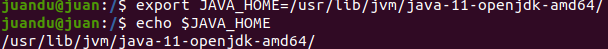
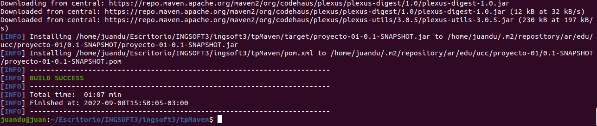

# Herramientas de Construccion de Software
## Instalacion
### Java JDK
- Instalar segun SO
- Agregar la variable de entorno JAVA_HOME:

    

### Maven
- Instalar con el comando: 
> sudo apt install maven
- Agregar PATH: 
> export PATH=/opt/apache-maven-3.6.1/bin:$PATH

### Introduccion a Maven
- Qué es Maven?
~~~ 
    Apache Maven es una herramienta que estandariza la configuración de un proyecto en todo su ciclo de vida, como por ejemplo en todas las fases de compilación y empaquetado y la instalación de mecanismos de distribución de librerías, para que puedan ser utilizadas por otros desarrolladores y equipos de desarrollo.
~~~ 
- Qué es el archivo POM?
~~~
    Maven utiliza un Project Object Model (POM) para describir el proyecto de software a construir, sus dependencias de otros módulos y componentes externos, y el orden de construcción de los elementos.
~~~
    
Ejemplo
~~~
    <project>
      <modelVersion>4.0.0</modelVersion> // indica la versión del modelo POM actual. Para Maven2 y Maven3, solo puede ser 4.0.0
     
      <groupId>com.mycompany.app</groupId> // define el proyecto real al que pertenece el proyecto Maven actual

      <artifactId>my-app</artifactId> // este elemento define un módulo maven en el proyecto real, el único ID del proyecto actual en el grupo

      <version>1</version> // define el proyecto real al que pertenece el proyecto Maven actual
    </project>
~~~
- Repositorios
~~~
Hay dos tipos de repositorios: locales y remotos:

    El repositorio local es un directorio en la computadora donde se ejecuta Maven. 
Almacena en caché las descargas remotas y contiene artefactos de compilación temporales que aún no ha publicado.

    Los repositorios remotos se refieren a cualquier otro tipo de repositorio, al que se accede
mediante una variedad de protocolos, como file:// y https://. 
Estos repositorios pueden ser un repositorio verdaderamente remoto configurado por un tercero para proporcionar sus artefactos para descargar (por ejemplo, repo.maven.apache.org). 
Otros repositorios "remotos" pueden ser repositorios internos configurados en un servidor de archivos o HTTP dentro de su empresa, utilizados para compartir artefactos privados entre equipos de desarrollo y para lanzamientos.
~~~
- Ciclos de Vida del Build
~~~
Existen tres ciclos de vida en el sistema: default, clean y site.
default: controla el despliegue de tu proyecto
clean: controla la limpieza de tu proyecto. Es decir, se encarga de eliminar todos los archivos generados en el proceso de construcción y despliegue.
site: controla la creación del site de documentación de tu proyecto.
~~~
- Fases del ciclo default
  
|Fase de build | Descripción| 
|--------- | ----------- |
|validate | valida si el proyecto está correcto y toda la información está disponible|
|compile | compila el código fuente del proyecto|
|test | prueba el código fuente compilado utilizando un marco de prueba de unidad adecuado. Estas pruebas no deberían requerir que el código se empaquete o implemente package toma el código compilado y lo empaqueta en su formato distribuible, como un JAR.|
|verify| ejecuta cualquier verificación de los resultados de las pruebas de integración para garantizar que se cumplan los criterios de calidad|
|install | instala el paquete en el repositorio local, para usarlo como dependencia en otros proyectos localmente|
|deploy| hecho en el entorno de compilación, copia el paquete final en el repositorio remoto para compartirlo con otros desarrolladores y proyectos.|

- Corriendo un pom.xml

> Vemos como al principio obtiene los plugins desde el repo central y finalmente buildea y crea un repo local

## Maven
- Generar proyecto inicial
> mvn archetype:generate-DgroupId=ar.edu.ucc-DartifactId=ejemplo-DarchetypeArtifactId=maven-archetype-quickstart-DinteractiveMode=false
- Complilar
> mvn clean package

 Se buildeo el servicio, se crearon las clases y se corre el archivo test.

- Corriendo el .jar generado, la app nos devuelve un print de "hola mundo"
  
