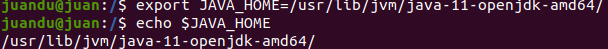
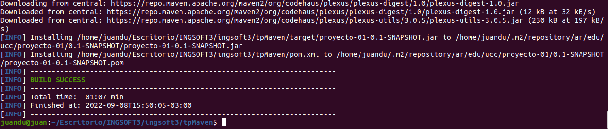
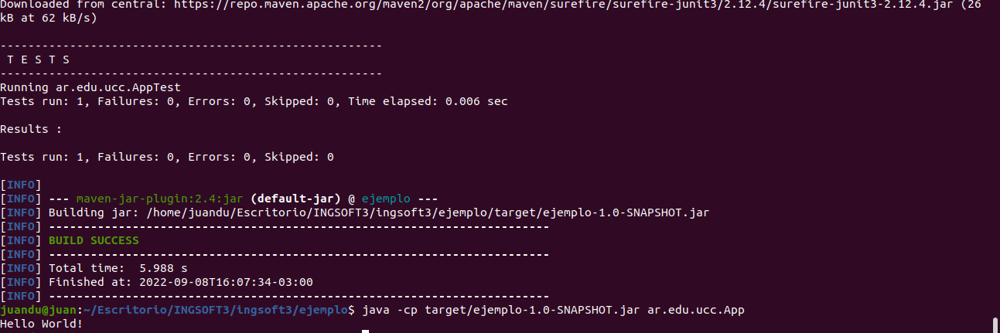
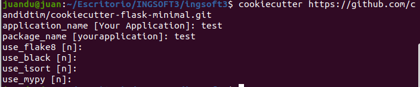
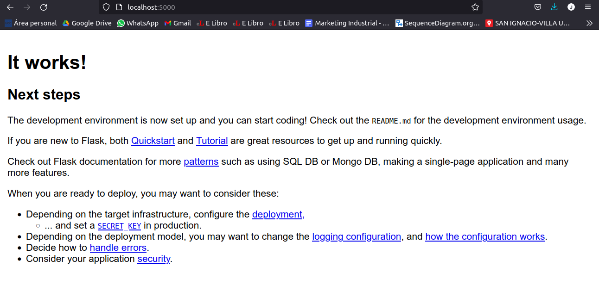

# Herramientas de Construccion de Software
## Instalacion
### Java JDK
- Instalar segun SO
- Agregar la variable de entorno JAVA_HOME:

    

### Maven
- Instalar con el comando: 
> sudo apt install maven
- Agregar PATH: 
> export PATH=/opt/apache-maven-3.6.1/bin:$PATH

### Introduccion a Maven
- Qué es Maven?
~~~ 
    Apache Maven es una herramienta que estandariza la configuración de un proyecto en todo su ciclo de vida, como por ejemplo en todas las fases de compilación y empaquetado y la instalación de mecanismos de distribución de librerías, para que puedan ser utilizadas por otros desarrolladores y equipos de desarrollo.
~~~ 
- Qué es el archivo POM?
~~~
    Maven utiliza un Project Object Model (POM) para describir el proyecto de software a construir, sus dependencias de otros módulos y componentes externos, y el orden de construcción de los elementos.
~~~
    
Ejemplo
~~~
    <project>
      <modelVersion>4.0.0</modelVersion> // indica la versión del modelo POM actual. Para Maven2 y Maven3, solo puede ser 4.0.0
     
      <groupId>com.mycompany.app</groupId> // define el proyecto real al que pertenece el proyecto Maven actual

      <artifactId>my-app</artifactId> // este elemento define un módulo maven en el proyecto real, el único ID del proyecto actual en el grupo

      <version>1</version> // define el proyecto real al que pertenece el proyecto Maven actual
    </project>
~~~
- Repositorios
~~~
Hay dos tipos de repositorios: locales y remotos:

    El repositorio local es un directorio en la computadora donde se ejecuta Maven. 
Almacena en caché las descargas remotas y contiene artefactos de compilación temporales que aún no ha publicado.

    Los repositorios remotos se refieren a cualquier otro tipo de repositorio, al que se accede
mediante una variedad de protocolos, como file:// y https://. 
Estos repositorios pueden ser un repositorio verdaderamente remoto configurado por un tercero para proporcionar sus artefactos para descargar (por ejemplo, repo.maven.apache.org). 
Otros repositorios "remotos" pueden ser repositorios internos configurados en un servidor de archivos o HTTP dentro de su empresa, utilizados para compartir artefactos privados entre equipos de desarrollo y para lanzamientos.
~~~
- Ciclos de Vida del Build
~~~
Existen tres ciclos de vida en el sistema: default, clean y site.
default: controla el despliegue de tu proyecto
clean: controla la limpieza de tu proyecto. Es decir, se encarga de eliminar todos los archivos generados en el proceso de construcción y despliegue.
site: controla la creación del site de documentación de tu proyecto.
~~~
- Fases del ciclo default
  
|Fase de build | Descripción| 
|--------- | ----------- |
|validate | valida si el proyecto está correcto y toda la información está disponible|
|compile | compila el código fuente del proyecto|
|test | prueba el código fuente compilado utilizando un marco de prueba de unidad adecuado. Estas pruebas no deberían requerir que el código se empaquete o implemente package toma el código compilado y lo empaqueta en su formato distribuible, como un JAR.|
|verify| ejecuta cualquier verificación de los resultados de las pruebas de integración para garantizar que se cumplan los criterios de calidad|
|install | instala el paquete en el repositorio local, para usarlo como dependencia en otros proyectos localmente|
|deploy| hecho en el entorno de compilación, copia el paquete final en el repositorio remoto para compartirlo con otros desarrolladores y proyectos.|

- Corriendo un pom.xml

> Vemos como al principio obtiene los plugins desde el repo central y finalmente buildea y crea un repo local

## Maven
- Generar proyecto inicial
> mvn archetype:generate-DgroupId=ar.edu.ucc-DartifactId=ejemplo-DarchetypeArtifactId=maven-archetype-quickstart-DinteractiveMode=false
- Complilar
> mvn clean package

 Se buildeo el servicio, se crearon las clases y se corre el archivo test.

- Corriendo el .jar generado, la app nos devuelve un print de "hola mundo"
  

## Manejo de dependencias
Cambiando el codigo de la app.java, el build genera un error
~~~
COMPILATION ERROR : 
[INFO] -------------------------------------------------------------
[ERROR] /home/juandu/Escritorio/INGSOFT3/ingsoft3/ejemplo-uber-jar/src/main/java/ar/edu/ucc/App.java:[2,17] package org.slf4j does not exist
[ERROR] /home/juandu/Escritorio/INGSOFT3/ingsoft3/ejemplo-uber-jar/src/main/java/ar/edu/ucc/App.java:[3,17] package org.slf4j does not exist
[ERROR] /home/juandu/Escritorio/INGSOFT3/ingsoft3/ejemplo-uber-jar/src/main/java/ar/edu/ucc/App.java:[12,9] cannot find symbol
  symbol:   class Logger
  location: class ar.edu.ucc.App
[ERROR] /home/juandu/Escritorio/INGSOFT3/ingsoft3/ejemplo-uber-jar/src/main/java/ar/edu/ucc/App.java:[12,22] cannot find symbol
  symbol:   variable LoggerFactory
  location: class ar.edu.ucc.App
~~~

Agregando una dependencia, el build funciona y genera el .jar

Al correr la app con el comando: **java -cp target/ejemplo-uber-jar-1.0-SNAPSHOT.jar ar.edu.ucc.App** se genera el siguiente error
~~~
Exception in thread "main" java.lang.NoClassDefFoundError: org/slf4j/LoggerFactory
	at ar.edu.ucc.App.main(App.java:12)
Caused by: java.lang.ClassNotFoundException: org.slf4j.LoggerFactory
	at java.base/jdk.internal.loader.BuiltinClassLoader.loadClass(BuiltinClassLoader.java:581)
	at java.base/jdk.internal.loader.ClassLoaders$AppClassLoader.loadClass(ClassLoaders.java:178)
	at java.base/java.lang.ClassLoader.loadClass(ClassLoader.java:522)
	... 1 more
~~~

El error viene dado ya que no reconoce la libreria org/slf4j que contiene el loggerFactory

Al correr la app con el siguiente comando, en el cual definimos el path donde debe encontrar la libreroa: 
> java -cp target/ejemplo-uber-jar-1.0-SNAPSHOT.jar:$HOME/.m2/repository/org/slf4j/slf4j-api/1.7.22/slf4j-api-1.7.22.jar:$HOME/.m2/repository/ch/qos/logback/logback-classic/1.2.1/logback-classic-1.2.1.jar:$HOME/.m2/repository/ch/qos/logback/logback-core/1.2.1/logback-core-1.2.1.jar ar.edu.ucc.App
 
el resultado obtenido es el correcto, y la app devuelve:
~~~
16:22:22.762 [main] INFO ar.edu.ucc.App - Hola Mundo!
~~~

Una solucion mas comoda es incluir en el pom un plugin de maven llamado maven shade plugin. Entonces para correr la app no hace falta especificar el path.

## Ejemplo con Node.js
- Crear una nueva aplicacion con el comando **npx create-react-app my-app**
- npm maneja las dependencias y paquetes de la siguiente manera (ver package.json)
~~~
"dependencies": {
    "@testing-library/jest-dom": "^5.16.5",
    "@testing-library/react": "^13.4.0",
    "@testing-library/user-event": "^13.5.0",
    "react": "^18.2.0",
    "react-dom": "^18.2.0",
    "react-scripts": "5.0.1",
    "web-vitals": "^2.1.4"
~~~
**jest-dom**: Libreria que provee de componentes DOM (Data Object Modelling) para realizar pruebas.

**react**: Framework para la facilitación de la creación de aplicaciones reactivas de una sola pagina.

**react-dom**: proporciona métodos específicos del DOM que pueden ser utilizados en el nivel más alto de tu aplicación como una alternativa a React.

**react-scripts**: incluye configuraciones y scripts para la realización de la app por default de React "Create App React".

**web-vitals**: iniciativa de Google para proporcionar una guía unificada de indicadores de calidad.

## Ejemplo con python
- Instalar dependencias de python:
> sudo apt install build-essential python3-dev
> pip3 install cookiecutter

- Correr el scaffold 
~~~
cookiecutter https://github.com/candidtim/cookiecutter-flask-minimal.git
~~~

-Corremos la app en /test con el comando **make run**

|Tool | Descripción| 
|--------- | ----------- |
| cookiecutter | Sin duda, uno de los dolores de cabeza para cualquier persona que se dedique a realizar un proyecto de código, es organizar las carpetas y archivos en nuestro equipo. Ya sea backend, frontend o Data Science la problemática es la misma. Cookiecutter es una herramienta que permite automatizar este proceso, podrás usar platillas de otros desarrolladores o crear la tuya. Podremos ser más organizados, profesionales y ahorraremos mucho tiempo.|
| make | se encarga de construir programas. Es una herramienta muy poderosa que sirve para varias cosas, la más simple de ellas es compilar y ejecutar código|
| pip |  es el comando para instalar paquetes de Python integrados. Automatiza la conexión al sitio https://pypi.org/, la descarga, la instalación e incluso la compilación del módulo solicitado. Además, se ocupa de las dependencias de cada paquete.|