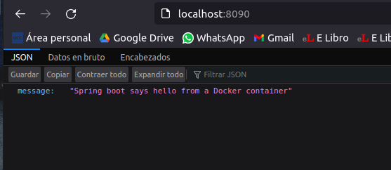
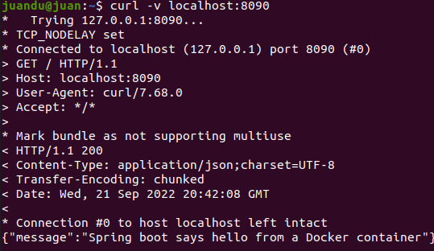
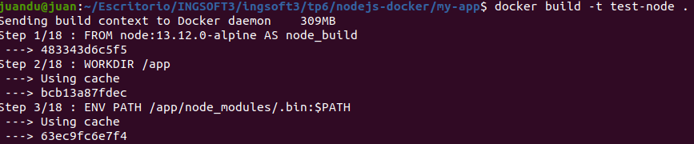
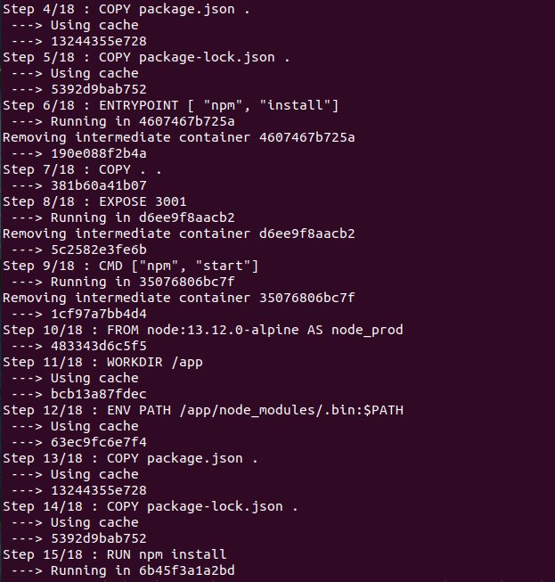
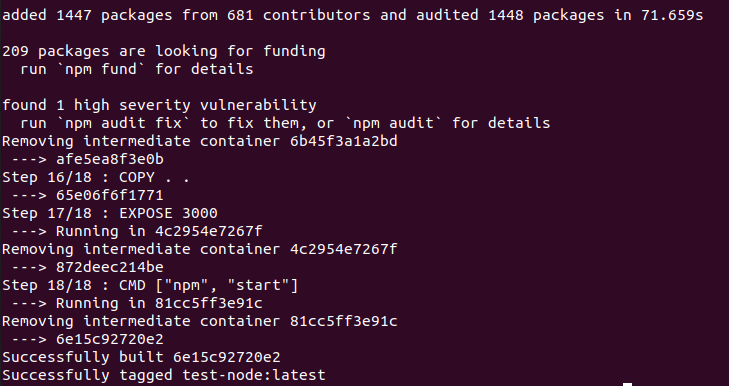
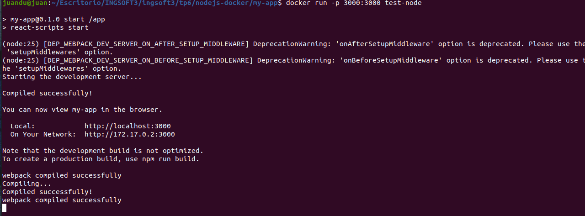
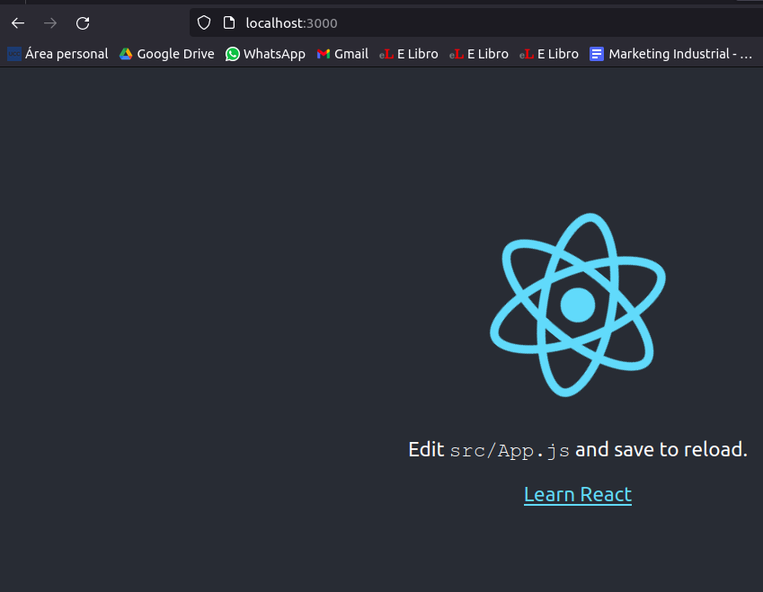
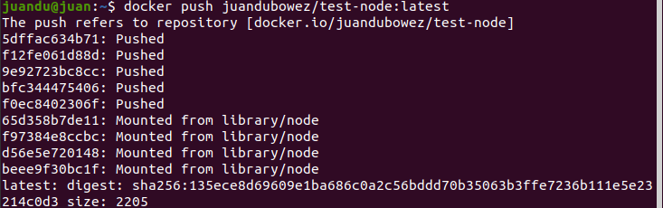
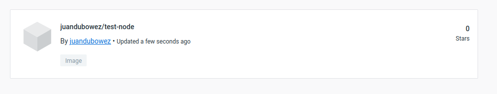

# Construcción de Imágenes de Docker
## Dockerfiles
- Un Dockerfile es un archivo o documento de texto simple que incluye una serie de instrucciones que se necesitan ejecutar de manera consecutiva para cumplir con los procesos necesarios para la creación de una nueva imagen
  
**FROM**: La instrucción FROM especifica la imagen principal a partir de la cual está construyendo. FROM solo puede estar precedido por una o más instrucciones ARG.

**RUN**: Es un paso de la creación de imagen, el estado del contenedor después de un comando RUN se confirmará en la imagen del contenedor. Un Dockerfile puede tener muchos pasos RUN que se superponen para construir la imagen. 

**ADD**: El comando ADD se usa para copiar archivos/directorios en una imagen de Docker.

**COPY**: COPY es un comando que copia archivos desde una ubicación de origen local a un destino en un contenedor Docker

**EXPOSE**: La instrucción EXPOSE expone un puerto particular con un protocolo específico dentro de un Docker Container. En el término más simple, la instrucción EXPOSE le dice a Docker que obtenga toda la información requerida durante el tiempo de ejecución desde un puerto específico. Estos puertos pueden ser TCP o UDP, pero es TCP por defecto

**CMD**: Es el comando que el contenedor ejecuta de forma predeterminada cuando inicia la imagen creada.Es decir,especifica la instrucción que se ejecutará cuando se inicie un contenedor. El propósito principal del comando CMD es lanzar el software requerido en un contenedor.

**ENRTYPOINT**: Se usa una instrucción ENTRYPOINT para establecer ejecutables que siempre se ejecutarán cuando se inicie el contenedor. A diferencia de los comandos CMD, los comandos ENTRYPOINT no se pueden ignorar ni anular, incluso cuando el contenedor se ejecuta con los argumentos de la línea de comandos indicados.

## Generar imagen de Docker
- Crear un proyeto en este caso con java spring boot
- Buildearlo con maven
- Agregamos el Dockerfile al directorio donde se corrio el maven:
~~~
FROM openjdk:8-jre-alpine

EXPOSE 8080

RUN mkdir /app

COPY target/*.jar ./spring-boot-sample-actuator.jar

ENV JAVA_OPTS="-Xms32m -Xmx128m"

ENTRYPOINT exec java $JAVA_OPTS -Djava.security.egd=file:/dev/./urandom -jar spring-boot-sample-actuator.jar

HEALTHCHECK --interval=1m --timeout=3s CMD wget -q -T 3 -s http://localhost:8090/actuator/health/ || exit 1
~~~
- Generar la imagen con el comando
> docker build -t test-spring-boot .

- Ejecutamos la imagen para que cree el contenedor donde correra la spring boot app
> docker run -p 8090:8080 test-spring-boot

-Verificar si retorna un mensaje
>curl -v localhost:8090

## Dockerfile Multi Etapas
- Modificar el Dockerfile anterior por el siguiente
~~~
FROM maven:3.5.2-jdk-8-alpine AS MAVEN_TOOL_CHAIN
COPY pom.xml /tmp/
RUN mvn -B dependency:go-offline -f /tmp/pom.xml -s /usr/share/maven/ref/settings-docker.xml
COPY src /tmp/src/
WORKDIR /tmp/
RUN mvn -B -s /usr/share/maven/ref/settings-docker.xml package

FROM openjdk:8-jre-alpine

EXPOSE 8080

RUN mkdir /app
COPY --from=MAVEN_TOOL_CHAIN /tmp/target/*.jar /app/spring-boot-application.jar

ENV JAVA_OPTS="-Xms32m -Xmx128m"

ENTRYPOINT exec java $JAVA_OPTS -Djava.security.egd=file:/dev/./urandom -jar /app/spring-boot-application.jar

HEALTHCHECK --interval=1m --timeout=3s CMD wget -q -T 3 -s http://localhost:8090/actuator/health/ || exit 1
~~~

Este nuevo Dockerfile crea tambien una imagen de maven, con maven agrega dependencias corre el comando para buildear el pom.xml

## Python Flask
- Correr el docker-compose
- El compose levanta una imagen de redis
- La key **build.context** da las opciones de configuración que se aplican en el momento de la compilación, el context brinda una ruta de contexto de compilacion, ya sea una ruta a un directorio que contenga un Dockerfile o una URL a un repositorio de git.

## Imagen para aplicación web en Nodejs
- Dockerfile multi etapa para crear la imagen:
~~~

FROM node:13.12.0-alpine AS node_build

# set working directory
WORKDIR /app

# add `/app/node_modules/.bin` to $PATH
ENV PATH /app/node_modules/.bin:$PATH

# install app dependencies
COPY package.json .
COPY package-lock.json .

ENTRYPOINT [ "npm", "install"]

# copy app to container
COPY . .

EXPOSE 3001

# starts the app
CMD ["npm", "start"]

FROM node:13.12.0-alpine AS node_prod

# set working directory
WORKDIR /app

# add `/app/node_modules/.bin` to $PATH
ENV PATH /app/node_modules/.bin:$PATH

# install app dependencies
COPY package.json .
COPY package-lock.json .

RUN npm install

# copy app to container
COPY . .

EXPOSE 3000

# starts the app
CMD ["npm", "start"]
~~~
- Ingresar el comando para buildear la imagen: 
> docker build -t test-node .

- Correr la imagen docker creada
> docker run -p 3000:3000 test-node

## Publicar la imagen en Docker Hub
- Publicando imagen desde la terminal

- Imagen subida a Docker hub
