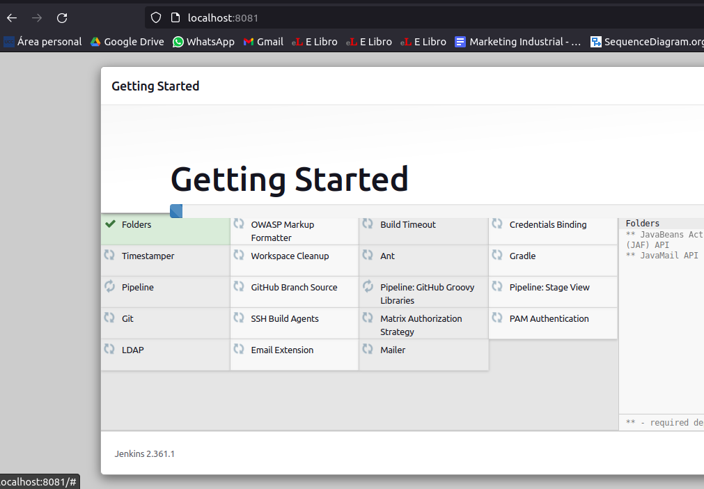
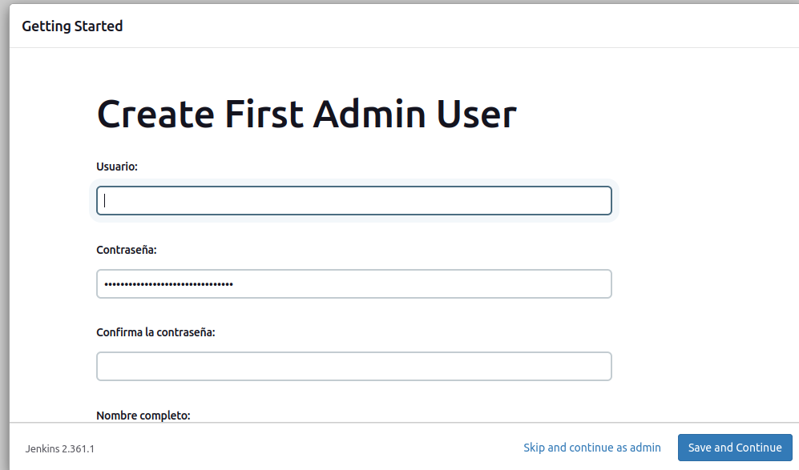
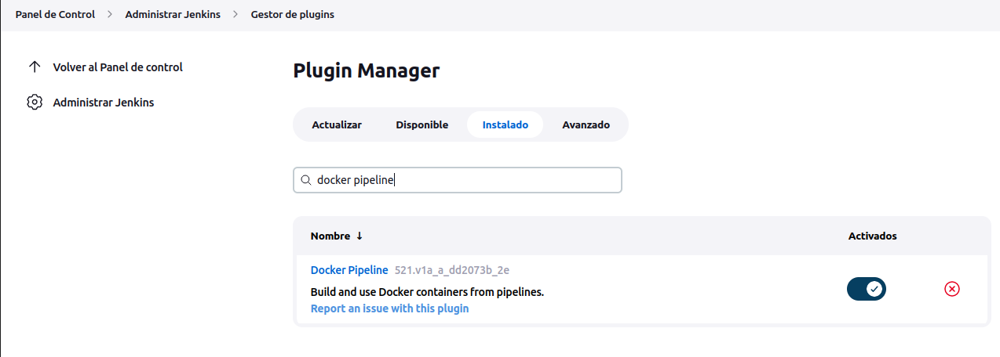
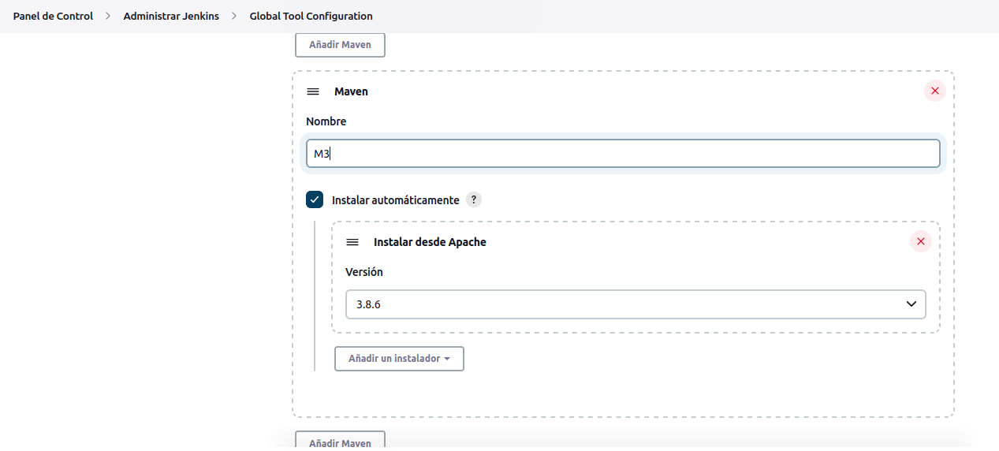
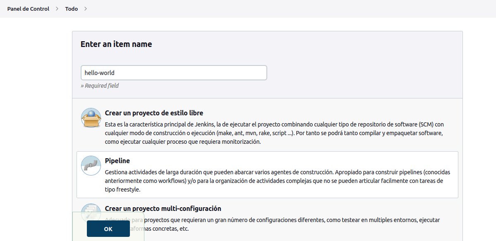
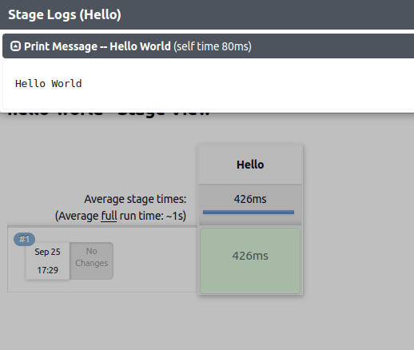
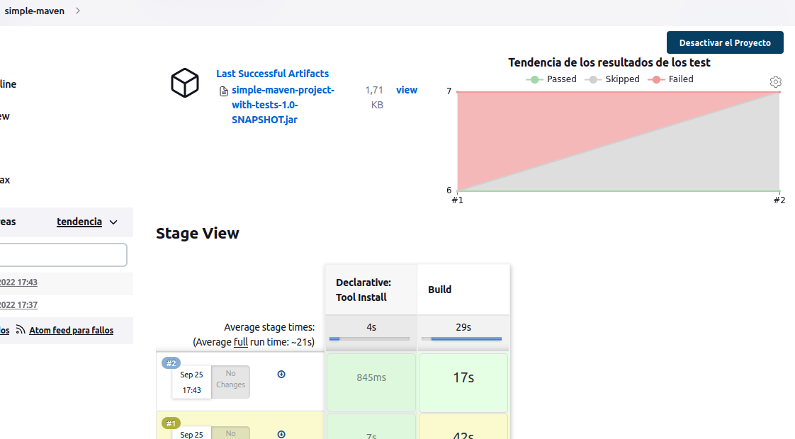
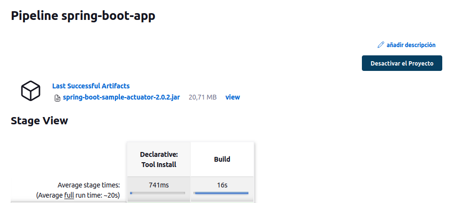
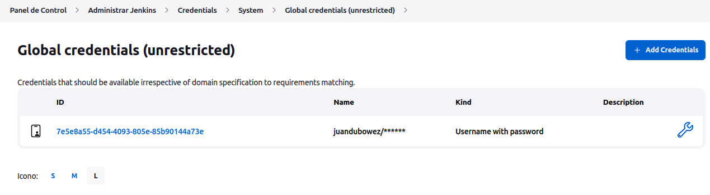
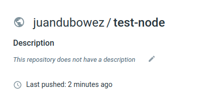

# Trabajo Práctico 7 - Servidor de Build (de integración continua)

## Poniendo en funcionamiento Jenkins
- Proceso de instalacion:
~~~
export JENKINS_HOME=~/jenkins

mkdir -p $JENKINS_HOME
cd $JENKINS_HOME

wget http://mirrors.jenkins.io/war-stable/latest/jenkins.war

java -jar jenkins.war --httpPort=8081
~~~
- Instalar los plugins por defecto:
  

- Crear el usuario admin inicial:
  

- Se aconseja perisistir la variable JENKINS_HOME, por ejemplo en .bashrc
  
## Instalando Plugins y configurando herramientas

- En Administrar Jenkins vamos a la sección de Administrar Plugins
- De la lista de plugins disponibles instalamos Docker Pipeline

- Instalamos sin reiniciar el servidor.
- Abrir nuevamente página de Plugins y explorar la lista, para familiarizarse qué tipo de plugins hay disponibles.
- En la sección de administración abrir la opción de configuración de herramientas
- Agregar maven con el nombre de M3 y que se instale automáticamente.

## Creando el primer Pipeline Job
- Crear un nuevo item, del tipo Pipeline con nombre hello-world:
  

- Una vez creado el job, en la sección Pipeline seleccionamos try sample Pipeline y luego Hello World

~~~
pipeline {
    agent any

    stages {
        stage('Hello') {
            steps {
                echo 'Hello World'
            }
        }
    }
}
~~~

- Guardamos y ejecutamos el Job

> El pipeline posee un solo stage llamado Hello, donde printea "Hello World".

## Creando un Pipeline Job con Git y Maven
- Creamos un ítem con el nombre simple-maven
- Elegir Git + Maven en la sección try sample Pipeline

~~~
pipeline {
    agent any

    tools {
        // Install the Maven version configured as "M3" and add it to the path.
        maven "M3"
    }

    stages {
        stage('Build') {
            steps {
                // Get some code from a GitHub repository
                git 'https://github.com/jglick/simple-maven-project-with-tests.git'

                // Run Maven on a Unix agent.
                sh "mvn -Dmaven.test.failure.ignore=true clean package"

                // To run Maven on a Windows agent, use
                // bat "mvn -Dmaven.test.failure.ignore=true clean package"
            }

            post {
                // If Maven was able to run the tests, even if some of the test
                // failed, record the test results and archive the jar file.
                success {
                    junit '**/target/surefire-reports/TEST-*.xml'
                    archiveArtifacts 'target/*.jar'
                }
            }
        }
    }
}
~~~

- Guardar y ejecutar el Job

> Analizando el codigo vemos que usa la herramienta de maven M3 (previamente creada). Contiene un stage llamado build con dos pasos: obtiene un codigo de un repositorio de github, lo buildea con mvn package.  Luego el paso post publica el resultado del test y el .jar.

## Utilizando nuestros proyectos

- Crear un Job que construya el proyecto spring-boot del trabajo práctico 6.
- Generar y publicar los artefactos que se producen.
- Como resultado de este ejercicio proveer el script en un archivo spring-boot/Jenkinsfile

## Publicar imagen en Docker hub
- Agregar credenciales de Docker
  

- Imagen publicada en Docker hub a traves del pipeline

